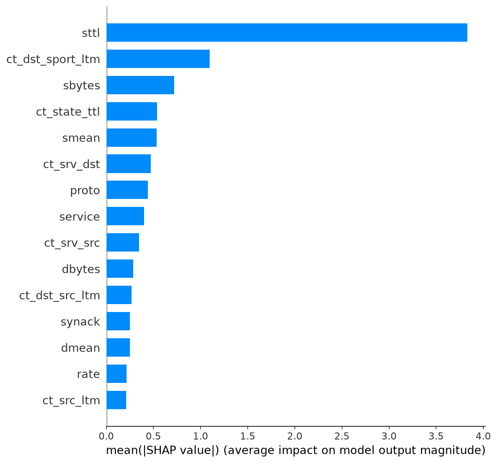

# Network Intrusion Detection System — ML + Explainable AI + Cross-Dataset Validation

A machine-learning-based Network Intrusion Detection System built on UNSW-NB15, with SHAP/LIME explainability and a cross-dataset generalization test against CIC-IDS2017. Built as a self-directed project to go deeper than a typical "train a classifier, report accuracy" exercise — the focus here is on explaining *why* the models decide what they decide, and honestly testing whether that holds up outside the dataset it was trained on.

## Why this project is different from the usual UNSW-NB15 tutorial

Most public UNSW-NB15 projects stop at one classifier and an accuracy number. This one:

- Compares **4 model families** (Random Forest, SVM, MLP, XGBoost) on the same real pipeline
- Applies **both SHAP and LIME**, cross-checked across two structurally different models, to explain — not just report — the results
- Actually attempts **cross-dataset generalization** (train on UNSW-NB15, test on CIC-IDS2017) — something most student/tutorial projects skip entirely because it's genuinely harder to get right
- Documents the **real bugs hit and fixed** along the way (see [Engineering Notes](#engineering-notes--bugs-found-and-fixed)), instead of presenting a sanitized "it just worked" narrative

## Results

### Binary classification (Normal vs. Attack)

| Model | Accuracy | Precision (Attack) | Recall (Attack) | F1 | ROC-AUC | Train Time |
|---|---|---|---|---|---|---|
| **XGBoost** | **0.871** | 0.82 | 0.98 | 0.89 | **0.982** | **4.0s** |
| Random Forest | 0.870 | 0.82 | 0.99 | 0.89 | 0.982 | 8.0s |
| MLP | 0.864 | 0.82 | 0.97 | 0.89 | 0.971 | 249.8s |
| SVM (RBF) | 0.813 | 0.75 | 1.00 | 0.85 | 0.945 | 25.4s* |

*\*SVM trained on a 20K-row subsample — RBF kernel training cost scales ~quadratically, making full-dataset training impractical. See engineering notes.*

**Consistent finding across all 4 models:** high recall on Attack (0.97–1.00) paired with lower recall on Normal (0.59–0.74) — the models rarely miss a real attack, but flag a meaningful share of normal traffic too. Held across 4 different algorithm families, so it's very likely a property of the data, not a model quirk.

### Explainability — what actually drives detection

SHAP analysis on both Random Forest and XGBoost independently converged on the same answer: **`sttl` (source-to-destination TTL) dominates everything else**, by roughly 3–4x over the next feature.



LIME went further and found this isn't the whole story — one attack instance was caught almost entirely via packet/byte-volume features, with `sttl` not even appearing in its top 10. Global feature rankings (SHAP) and per-instance explanations (LIME) tell different parts of the story; this project reports both rather than picking one.

### Cross-dataset validation (UNSW-NB15 → CIC-IDS2017)

| Model | In-Dataset Accuracy | Cross-Dataset Accuracy |
|---|---|---|
| XGBoost | 87.1% | 42.7% |
| Random Forest | 87.0% | 34.1% |

A real, expected drop — only 8 of 42 features have any CIC-IDS2017 equivalent, and `sttl`, the single most important feature, isn't one of them. Getting to this credible result required finding and fixing two real bugs first (see below).

### Multiclass (per-attack-category) results

| Category | Support | XGBoost F1 | Random Forest F1 (balanced) |
|---|---|---|---|
| Normal | 37,000 | 0.85 | 0.74 |
| Generic | 18,871 | 0.98 | 0.98 |
| Exploits | 11,132 | 0.71 | 0.70 |
| Fuzzers | 6,062 | 0.38 | 0.37 |
| DoS | 4,089 | 0.21 | 0.24 |
| Reconnaissance | 3,496 | 0.86 | 0.85 |
| Analysis | 677 | 0.09 | 0.02 |
| Backdoor | 583 | 0.05 | 0.09 |
| Shellcode | 378 | 0.49 | 0.33 |
| Worms | 44 | 0.50 | 0.66 |

Class-weighting (Random Forest) traded majority-class precision for rare-class recall — it's not a free win. Full breakdown of that trade-off is in the [report](Results_and_Discussion_Draft.md).

## Engineering notes — bugs found and fixed

The cross-dataset validation surfaced two genuine implementation bugs worth mentioning, since diagnosing them is arguably more representative of real ML engineering than the final clean numbers:

1. **Silent scaling bug** — an early cross-dataset run produced *byte-identical* results between Random Forest and XGBoost (a dead giveaway something was wrong, since two different algorithms shouldn't agree to 4 decimal places). Root cause: raw, unscaled CIC-IDS2017 values were being fed into models trained on standardized features. Fixed by reusing the exact fitted `StandardScaler` from training.
2. **Unit mismatch between datasets** — even after fixing the scaling bug, results stayed skewed. UNSW-NB15's `dur` field is in seconds; CIC-IDS2017's `Flow Duration` (different tool: CICFlowMeter vs. Argus) is in **microseconds** — a 1,000,000x scale difference for a "matched" feature. Fixed with explicit unit-conversion factors.

Also handled: a `shap` library version change that returns 3D arrays instead of the older list-of-arrays format (silently produced a mislabeled, broken plot until caught and fixed), and SVM's quadratic training-cost blowup on the full 175K-row dataset (fixed via a documented, deliberate subsample).

## Tech Stack

`Python` · `pandas` / `NumPy` · `scikit-learn` · `XGBoost` · `SHAP` · `LIME` · `matplotlib` / `seaborn` · `Jupyter`

## Project Structure

```
nids_project/
├── data/raw/                  # UNSW-NB15 + CIC-IDS2017 CSVs (not included; see below)
├── sample_data/                # synthetic data for testing the pipeline without the real download
├── src/
│   ├── data_preprocessing.py   # loading, encoding, scaling
│   ├── train_models.py         # trains & evaluates all 4 binary models
│   ├── explainability.py       # SHAP + LIME
│   ├── cross_dataset_validation.py
│   └── multiclass_evaluation.py
├── notebooks/                  # EDA + modeling walkthroughs
├── reports/figures/            # all generated plots
└── requirements.txt
```

## Running It

```bash
pip install -r requirements.txt

# Works immediately with synthetic sample data:
python src/train_models.py

# For real results, download UNSW-NB15 (training-set/testing-set CSVs)
# into data/raw/, then re-run the same commands.
python src/explainability.py --model xgboost
python src/cross_dataset_validation.py --model xgboost --sample_n 100000
python src/multiclass_evaluation.py --model random_forest
```

Dataset sources: [UNSW-NB15](https://research.unsw.edu.au/projects/unsw-nb15-dataset) · [CIC-IDS2017](https://www.unb.ca/cic/datasets/ids-2017.html)

## Honest Limitations

- SHAP was applied to Random Forest and XGBoost only — not SVM/MLP
- Cross-dataset feature overlap is limited to 8/42 features by design (different tools, different schemas)
- The Normal-class false-positive rate (~26–41%) is identified and explained, not yet mitigated with threshold tuning or resampling

## Context

This is a self-directed exploration project, built to practice explainable ML and rigorous generalization testing beyond a single benchmark dataset — not a course submission. Feedback and issues welcome.